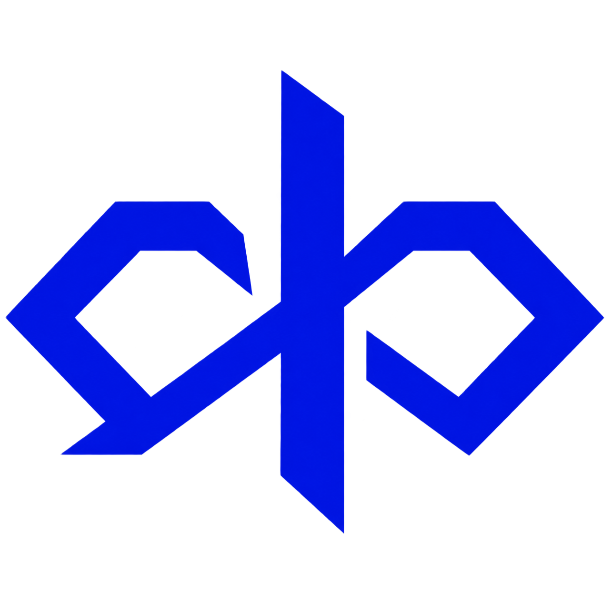

<div align="center">



# Kramak Lite

**Turn vibe coding into verified engineering.**

An autonomous development engine for AI coding agents.
Zero dependencies. Any IDE. Any model.

[](LICENSE)
[](.kramak/KRAMAK-LITE.md)
[](.kramak/KRAMAK-LITE.md)
[](https://github.com/bhaskarjha-dev/kramak)

</div>

---

## The Problem

AI coding agents are powerful but unreliable. Without guardrails, they:

| Failure | What Happens | How Kramak Prevents It |
|---|---|---|
| **Scope drift** | Agent touches 30 files when the task needed 3 | `files_targeted` boundary per Work Item + pre-edit intercept |
| **Hallucinated code** | Agent writes code based on APIs that don't exist | 5-step Grounded Verification: LOCATE → QUOTE → VERIFY → DESIGN → CROSS-CHECK |
| **Silent degradation** | Quality drops after Work Item #5 but the agent can't tell | Hard stop gates: ≥6 WIs, ≥20 files, ≥4 errors = mandatory fresh session |
| **Infinite retry loops** | Agent retries the same broken fix 20 times | Circuit breaker: 3 consecutive failures or oscillation = stop and escalate |
| **Untested output** | "Looks right" but was never actually run | Mandatory verification: `checkCommands` run after every change |

**But guardrails alone aren't enough.** An agent that follows rules mechanically is just a task executor. Kramak Lite gives the agent **strategic intelligence** — the ability to think like a CTO, assess the project from multiple perspectives, plan dynamically, and adapt.

Kramak Lite does all this. In one Markdown file (~45KB). With zero runtime dependencies.

---

## Quick Start (2 Minutes)

### 1. Copy `.kramak/` into your project

```bash
git clone https://github.com/bhaskarjha-dev/kramak-lite.git
cp -r kramak-lite/.kramak/ your-project/.kramak/
```

> **Why `.kramak` and not `.kramak-lite`?** The `.kramak` directory is the ecosystem namespace — like `.git` or `.vscode`. The file inside (`KRAMAK-LITE.md`) identifies which version you're running. Upgrading to full Kramak later is seamless: just replace the directory contents. [More in FAQ →](#faq)

### 2. Add your IDE adapter

Pick your IDE and follow the instructions:

<details>
<summary><strong>🟣 Antigravity IDE</strong></summary>

```bash
mkdir -p .agents/skills/kramak/
cp kramak-lite/adapters/antigravity/SKILL.md .agents/skills/kramak/SKILL.md
```

This installs Kramak as an Antigravity skill. No conflicts with existing skills.

</details>

<details>
<summary><strong>🟠 Claude Code</strong></summary>

**If you don't have a CLAUDE.md yet:**
```bash
cp kramak-lite/adapters/claude-code/CLAUDE.md ./CLAUDE.md
```

**If you already have a CLAUDE.md** (don't overwrite it!):
```bash
echo "" >> ./CLAUDE.md
cat kramak-lite/adapters/claude-code/CLAUDE.md >> ./CLAUDE.md
```

This appends the Kramak section to your existing rules.

</details>

<details>
<summary><strong>🔵 Cursor</strong></summary>

```bash
mkdir -p .cursor/rules/
cp kramak-lite/adapters/cursor/.cursorrules .cursor/rules/kramak.mdc
```

Cursor loads all `.mdc` files from `.cursor/rules/`. No conflicts with existing rules.

</details>

<details>
<summary><strong>⚪ Other IDEs</strong> (Windsurf, Cline, Gemini CLI, etc.)</summary>

**If you don't have an AGENTS.md / GEMINI.md yet:**
```bash
cp kramak-lite/adapters/generic/AGENTS.md ./AGENTS.md
```

**If you already have one** (don't overwrite it!):
```bash
echo "" >> ./AGENTS.md
cat kramak-lite/adapters/generic/AGENTS.md >> ./AGENTS.md
```

Rename to `GEMINI.md`, `.clinerules`, or whatever your IDE reads.

</details>

### 3. Say **"Start"**

Open your AI agent and type: **Start**

That's it. The agent will assess the project strategically, plan Work Items from the right perspective, execute them with scope enforcement, audit the results, and plan the next batch — all autonomously.

---

## How It Works

```
         ┌──────────┐
         │ PLANNING  │ ← Strategic vision, perspective selection, batch plan
         └─────┬─────┘
               │
         ┌─────▼─────┐
         │ EXECUTING  │ ← Implement WIs with scope check + testing
         └─────┬─────┘
               │
         ┌─────▼─────┐
         │ AUDITING   │ ← Review all changes with fresh eyes
         └─────┬─────┘
               │
         ┌─────▼─────┐
    ┌────│ COMPLETE?  │────┐
    │ No └────────────┘ Yes│
    ▼                      ▼
  Back to PLANNING       Done!
```

**State** is tracked in `.kramak/state.json`.
**Batch plans** live in `.kramak/plans/`.
**Work Items** live in `.kramak/work-items/`.
**User goals & feedback** go in `.kramak/inbox/INBOX.md`.
**Cross-session history** is logged in `.kramak/SESSION-LOG.md`.
Everything is plain Markdown and JSON — no runtime, no CLI, no magic.

---

## Key Concepts

### Strategic Intelligence (What Makes This an Engine, Not a Checklist)

The planner doesn't just follow a roadmap mechanically. It:

1. **Assesses strategically** — 5-lens vision system (Quality, User Journey, Competitive, Innovation, Architecture) triggers at milestones or periodic intervals
2. **Thinks meta-cognitively** — PERCEIVE → REASON → DECIDE loop: "What's the biggest risk? Biggest opportunity? What's been neglected?"
3. **Selects perspectives** — Reasons into the right viewpoint (Solution Architect, UX Designer, CEO, Security Engineer, etc.) rather than defaulting to "developer"
4. **Prioritizes by product phase** — BUILD/SHIP/ITERATE priority ladders determine what work matters most right now
5. **Sizes dynamically** — Batch size is driven by planning quality, not fixed numbers

### Work Items
The atomic unit of work. Each WI specifies what to change, which files to touch, and how to verify. Created during planning, executed one by one.

### Goldilocks Rule (Detail Scaling)
Not all changes need the same level of specification:

| Tier | When to Use | What the Agent Gets |
|---|---|---|
| **Guided** | High-risk (auth, payments, schemas) | Exact BEFORE/AFTER code blocks + 5-step verification |
| **Directed** | Standard changes (most WIs) | Intent + target files + constraints — agent owns the HOW |
| **Outcome** | Low-risk (docs, config, styling) | Acceptance criteria only — agent owns the design |

### Circuit Breaker
3 consecutive failures or oscillation detected → agent stops and escalates. No more infinite retry loops.

### Hard Stop Gates
Quantitative session limits that prevent context fatigue:
- **≥6 WIs completed** → fresh session
- **≥20 files modified** → fresh session
- **≥4 errors corrected** → fresh session
- **≥1 WI failed** → fresh session

Models cannot self-detect quality degradation — these gates enforce the pause.

### Product Phase (BUILD / SHIP / ITERATE)
Determines what kind of work to prioritize. BUILD focuses on architecture and features. SHIP focuses on deployment and security. ITERATE focuses on production issues and improvements. Each phase has an explicit priority ladder.

---

## What's Inside

```
your-project/
├── .kramak/
│   ├── KRAMAK-LITE.md              ← The spec (single file, ~45KB, v2.3.0)
│   ├── state.json                  ← Current state (auto-created)
│   ├── SESSION-LOG.md              ← Cross-session history (Planner/Executor/Auditor)
│   ├── HUMAN-TASKS.md              ← Async human blockers (API keys, decisions)
│   ├── schemas/
│   │   ├── state.schema.json       ← State validation schema
│   │   └── work-item.schema.json   ← Work Item validation schema
│   ├── plans/                      ← Batch plans & audit reports
│   ├── work-items/                 ← Work Items (auto-populated by planner)
│   ├── inbox/
│   │   └── INBOX.md                ← User goals and direction (you write here)
│   └── templates/                  ← Production templates
│       ├── session-log.md          ← Universal session log template
│       ├── inbox.md                ← Inbox template
│       ├── batch-plan.md           ← Batch plan template
│       ├── human-tasks.md          ← Human tasks template
│       ├── audit-report.md         ← Audit report template
│       ├── retrospective.md        ← Batch learning template
│       ├── WORK-ITEM.template.md   ← Master WI template
│       ├── work-item-guided.md     ← 🔴 Guided tier template
│       ├── work-item-directed.md   ← 🟡 Directed tier template
│       └── work-item-outcome.md    ← 🟢 Outcome tier template
└── ...your code...
```

---

## Kramak Lite vs Full Kramak

| Aspect | Kramak Lite | Kramak (Full) |
|---|---|---|
| **Spec size** | ~45KB (1 file, v2.3.0) | ~191KB (20 files) |
| **Rule coverage** | 100% of enforceable rules (173/173) | 176 rules (includes CLI-only guards) |
| **Strategic intelligence** | 5-lens vision + PERCEIVE→REASON→DECIDE + perspectives | Full 5-lens + multi-cycle perspective tracking |
| **States** | 6 (plan/exec/audit/wait/escalate/complete) | 9 (adds dispatch/merge_queue/bootstrap) |
| **Cross-session log** | Unified SESSION-LOG.md (Plan/Exec/Audit) | PLANNING-LOG + PROGRESS.md + RETRO |
| **Multi-agent** | Supported (optional) | Supported (with worktree isolation) |
| **Product lifecycle** | BUILD/SHIP/ITERATE with priority ladders | Full 5-lens strategic vision + GROWTH phase |
| **Failure recovery** | 6-category taxonomy + circuit breaker + recovery shortcuts | Full decision tree + ODC/MAST crosswalk |
| **Session management** | Hard stop gates + session weight + WAL atomic writes | Behavioral + quantitative + WAL-based recovery |
| **Capability gate** | Project-grounded inline verification | Full 5-challenge Canary battery |
| **IDE compatibility** | Any IDE, any model tier | Best with frontier models |
| **Runtime deps** | Zero | Zero |

**Kramak Lite is the autonomous engine. Full Kramak adds depth.** The full version provides extended on-demand modules, formal ODC/MAST failure crosswalks, deep diagnostic trees, and the 5-challenge Canary Capability Battery for rigorous model qualification.

---

## Documentation

| Document | What You'll Learn |
|---|---|
| **[Getting Started](docs/GETTING-STARTED.md)** | Step-by-step setup for every scenario (new project, existing project, existing AI config) |
| **[Architecture](docs/ARCHITECTURE.md)** | Why single-file, IDE compatibility strategy, token analysis, naming decisions |
| **[Full Kramak Mapping](docs/FULL-KRAMAK-MAPPING.md)** | Rule-by-rule coverage map of all 176 rules |
| **[Changelog](CHANGELOG.md)** | Version history with rationale for every change |

---

## FAQ

<details>
<summary><strong>Why is the directory called <code>.kramak</code> and not <code>.kramak-lite</code>?</strong></summary>

The `.kramak` directory is the **ecosystem namespace** for Kramak — like `.git` is for Git regardless of version, or `.vscode` is for VS Code. The file inside (`KRAMAK-LITE.md` vs `ROUTER.md`) identifies which edition you're running.

This design means:
- **Upgrading to full Kramak** later doesn't require renaming directories or updating adapter paths
- **All adapters** work with both Lite and Full because they reference `.kramak/`

</details>

<details>
<summary><strong>I already have a CLAUDE.md / AGENTS.md / GEMINI.md. Will this overwrite it?</strong></summary>

**No, if you follow the instructions.** The Quick Start includes explicit "append" commands for each IDE. Never `cp` over an existing config file — always `cat >> ` to append.

The Kramak adapter is a small section (~25 lines) that tells your agent how to find and follow `KRAMAK-LITE.md`. It cooperates with your existing rules — it doesn't replace them.

</details>

<details>
<summary><strong>Can I use Kramak Lite with multiple IDEs simultaneously?</strong></summary>

Yes. Install adapters for all IDEs you use. They're independent files in different locations (`.agents/skills/` for Antigravity, `CLAUDE.md` for Claude Code, `.cursor/rules/` for Cursor). They all point to the same `.kramak/KRAMAK-LITE.md`.

</details>

<details>
<summary><strong>I'm using full Kramak and want to switch to Lite. How?</strong></summary>

1. Back up your current `.kramak/state.json`
2. Replace your `.kramak/` contents with Kramak Lite's `.kramak/`
3. Copy your `state.json` back (the core fields are compatible)
4. Update your adapter if needed (they should work as-is)

Note: Full Kramak's extra phases (`dispatch`, `merge_queue`, `bootstrap`) and `GROWTH` product phase don't exist in Lite. If your `state.json` references these, update `phase` to the nearest Lite equivalent.

</details>

<details>
<summary><strong>Which AI models work best with Kramak Lite?</strong></summary>

Kramak Lite works with any model, but compliance varies:

| Model | Planning | Execution | Audit | Overall |
|---|---|---|---|---|
| Gemini 2.5 Pro | Excellent | Good | Good | **Strong** |
| Claude Opus 4.6 | Excellent | Excellent | Excellent | **Excellent** |
| Claude Sonnet 4.0 | Good | Good | Adequate | **Strong** |
| GPT-4o | Good | Adequate | Adequate | **Moderate** |
| Flash/Mini models | Adequate | May skip steps | May rubber-stamp | **Basic** |

All models benefit from the framework. Stronger models follow it more completely.

</details>

<details>
<summary><strong>What if my agent ignores the Kramak rules?</strong></summary>

This happens occasionally, especially with smaller models. Try:
1. **Restart the session** — say "Start" in a fresh conversation
2. **Check the adapter** — make sure it's in the right location for your IDE
3. **Be explicit** — say "Follow the Kramak workflow in `.kramak/KRAMAK-LITE.md`"
4. **Use a more capable model** — frontier models comply more consistently

For stronger enforcement, use a more capable model or consider upgrading to [full Kramak](https://github.com/bhaskarjha-dev/kramak).

</details>

---

## Requirements

- An AI coding agent with file read/write and terminal access
- That's it. No Node.js, no Python, no package manager.

## License

Apache 2.0

## Links

- [Kramak (Full)](https://github.com/bhaskarjha-dev/kramak) — The comprehensive 176-rule specification
